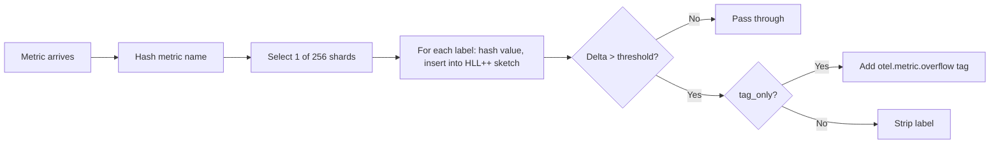
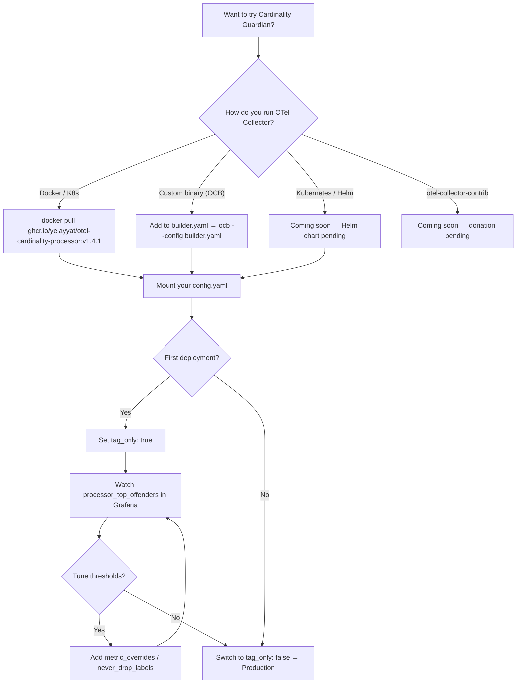

# Cardinality Guardian

[](https://github.com/YElayyat/otel-cardinality-processor/actions/workflows/ci.yml)
[](https://goreportcard.com/report/github.com/YElayyat/otel-cardinality-processor)
[](https://codecov.io/gh/YElayyat/otel-cardinality-processor)
[](https://pkg.go.dev/github.com/YElayyat/otel-cardinality-processor)
[](https://github.com/YElayyat/otel-cardinality-processor/releases)
[](https://opensource.org/licenses/Apache-2.0)
[](./CONTRIBUTING.md)
[](./BENCHMARKS.md)

An OpenTelemetry Collector processor that catches metric cardinality explosions before they reach your TSDB.

It strips only the exploding label — not the entire data point. Your dashboards keep working.

```yaml
processors:
  cardinality_guardian:
    max_cardinality_delta_per_epoch: 100
    epoch_duration_seconds: 300
    tag_only: true
```

## What it does

A developer pushes code that logs raw exception strings into `error.type`. Yesterday that label had 5 unique values. Today it has 50,000 and climbing. Your Datadog bill noticed before you did.

This processor sits in your OTel pipeline and detects labels with abnormal growth. It either strips them (enforcement mode) or tags them for routing (tag-only mode). The metric stays intact — only the bad label is removed.

```
Before:  {region="us-east", status="200", error.type="Lock wait timeout; txn=a3f9c..."}
After:   {region="us-east", status="200"}
```

`region` and `status` survive. Your latency dashboards keep working. The 50,000 unique exception strings are gone.

## How it works



Key design decisions:

- **Delta-based detection, not absolute thresholds.** A label with 50K stable values is fine. A label that grew by 100 in the last epoch is a problem. The processor tracks growth rate using dual-epoch HyperLogLog++ sketches, so legitimate high-cardinality metrics aren't penalized.

- **256-way sharding.** Each shard has its own `RWMutex`. With 50 concurrent goroutines across 256 shards, average occupancy is ~0.4 per shard. Contention is near zero. Shard selection is `hash & 0xFF` — one CPU cycle.

- **HLL++ with ~2KB per tracker.** Each sketch estimates cardinality regardless of whether 100 or 100M unique values have been observed. 1-2% accuracy. The `axiomhq/hyperloglog` library's `InsertHash(uint64)` path avoids allocation on the hot path.

- **Stale eviction.** Trackers that haven't been seen for two epochs are cleaned up. Memory stays bounded.

## Performance

| Benchmark | Result |
|---|---|
| Hot path (shouldDrop) | ~91 ns/op, **0 allocs** |
| Full pipeline passthrough | ~1.3 μs per batch |
| Sustained load (8 workers, 60s) | **870K metrics/sec** |
| telemetrygen blast (8 workers, 30s) | **827K metrics/sec**, zero errors |
| Memory (52M metrics over 60s) | Heap grew **12%** (5.3→5.9 MB) |

All benchmarks reproducible: `make bench` and `make bench-load`. Full details in [BENCHMARKS.md](BENCHMARKS.md).

## Configuration

```yaml
processors:
  cardinality_guardian:
    # Max new unique values per (metric, attribute) per epoch
    max_cardinality_delta_per_epoch: 100

    # Epoch rotation interval (seconds, minimum 10)
    epoch_duration_seconds: 300

    # true = tag only (add otel.metric.overflow), false = strip the label
    tag_only: true

    # Labels that are never stripped regardless of cardinality
    never_drop_labels:
      - region
      - environment
      - service.name

    # Per-metric threshold overrides (falls back to global if unset)
    metric_overrides:
      http.server.request.duration: 5000
      db.query.duration: 50

    # Emit gauge with top N highest-delta trackers
    top_offenders_count: 10

    # Max tracked metric+label pairs (0 = unlimited)
    max_tracker_count: 100000

    # Dollar value per series prevented, for ROI dashboards
    estimated_cost_per_metric_month: 0.05
```

## Comparison with existing processors

| | Cardinality Guardian | filterprocessor | metricstransformprocessor |
|---|---|---|---|
| Detection | Dynamic (growth rate) | Static allow/deny lists | Static rules |
| Granularity | Per-label | Per-metric (drops entire metric) | Per-metric |
| False positives on stable high-cardinality | No (delta-based) | Yes (if above threshold) | Yes |
| Tag-only mode | Yes | No | No |
| Per-metric overrides | Yes | N/A | N/A |
| Top-N offender reporting | Yes | No | No |
| Memory per tracker | ~2KB (HLL++) | N/A | N/A |

`filterprocessor` and `metricstransformprocessor` are configuration-driven: you tell them what to drop. This processor is data-driven: it figures out what to drop based on observed behavior. The use cases are complementary, not competing.

## Operation modes

### Enforcement (default)

The processor strips the offending label. The data point is preserved with remaining labels intact.

### Tag-only

The processor adds `otel.metric.overflow: true` without removing anything. Use this for:

- Initial deployment — see what gets flagged before enforcing
- Dual-routing — send tagged metrics to cheap storage, clean metrics to your TSDB
- Gradual rollout — switch to enforcement per-metric after validation

Start with tag-only. Always.

## Deployment Options



## Building the Collector (Custom OCB Build)

Because this is a custom processor, you must compile it into your binary using the OpenTelemetry Collector Builder (OCB). See the [official documentation](https://opentelemetry.io/docs/collector/extend/ocb/) for full details and release mapping.

### 1. Download OCB

You must download the specific `ocb` binary that matches both your operating system, your chipset, and your desired OpenTelemetry version. Be very careful to select the right asset from the releases page (e.g., Linux vs macOS, AMD64 vs ARM64).

For example, to download OTel `v0.148.0` on macOS ARM64:
```bash
curl --proto '=https' --tlsv1.2 -fL -o ocb \
  https://github.com/open-telemetry/opentelemetry-collector-releases/releases/download/cmd%2Fbuilder%2Fv0.148.0/ocb_0.148.0_darwin_arm64
chmod +x ocb
```

### 2. Create `builder.yaml`

Create a manifest file named `builder.yaml`. Ensure the component versions exactly match the version of your downloaded `ocb` binary (e.g., `v0.148.0`). You must also include the `name` and `import` overrides to correctly handle the hyphenated module path for the Cardinality Guardian.

```yaml
dist:
  name: otelcol-custom
  description: Custom OTel Collector with Cardinality Guardian
  output_path: ./build

exporters:
  - gomod: go.opentelemetry.io/collector/exporter/debugexporter v0.148.0

receivers:
  - gomod: go.opentelemetry.io/collector/receiver/otlpreceiver v0.148.0

processors:
  - gomod: go.opentelemetry.io/collector/processor/batchprocessor v0.148.0
  - gomod: github.com/YElayyat/otel-cardinality-processor v1.4.1
    name: cardinalityprocessor
    import: github.com/YElayyat/otel-cardinality-processor/cardinalityprocessor
```

### 3. Compile the Binary

```bash
./ocb --config=builder.yaml
```

Once the build successfully completes, OCB will create a new directory directly under the project root called `build/`. Inside this directory, you will find your compiled, static binary named `otelcol-custom`.

### 4. Configure and Run

Before running the built collector, you must create a configuration file (`otel-collector-config.yaml`) that defines your Cardinality Guardian pipeline parameters. Add the processor to your pipeline:

```yaml
# otel-collector-config.yaml

processors:
  cardinality_guardian:
    max_cardinality_delta_per_epoch: 100    # Max new unique values per (metric, attribute) per epoch
    epoch_duration_seconds: 300              # Length of the sliding window
    never_drop_labels:                       # Labels that are never stripped
      - region
      - http.status_code
      - service.name
    tag_only: false                           # true = observe only, false = enforce
    max_tracker_count: 0                     # Set > 0 to bound memory (0 = unlimited)
    top_offenders_count: 10                  # How many high-growth trackers to report via telemetry gauge
    estimated_cost_per_metric_month: 0.05    # For ROI tracking ($/series/month)
    metric_overrides:                        # Optional per-metric cardinality limits
      http.server.request.duration: 5000     # Allow higher headroom for routes
      db.query.duration: 50                  # Strict limit for DB queries

service:
  pipelines:
    metrics:
      receivers:  [otlp]
      processors: [cardinality_guardian]
      exporters:  [prometheusremotewrite]
```

Once your configuration is ready, run your custom binary:

```bash
./build/otelcol-custom --config=otel-collector-config.yaml
```

## Docker Deployment (Official Image)

The official Docker image is automatically built and published to the GitHub Container Registry (GHCR) and supports both `linux/amd64` and `linux/arm64`.

### 1. Pull the Image

To run the Cardinality Guardian, pull the latest official image:

```bash
docker pull ghcr.io/yelayyat/otel-cardinality-processor:v1.4.1
```

*(Optional: You can also build the secure, distroless-like multi-stage Dockerfile manually via `docker build -t ghcr.io/yelayyat/otel-cardinality-processor:latest .`)*

### 2. Quick Start (Local Testing)

You must mount your configuration file. By default, the `ENTRYPOINT` expects this configuration at `/etc/otelcol/config.yaml`. The collector operates as an unprivileged user (`otel`), exposing standard OTLP ports (4317, 4318), Prometheus metrics (8888), and the Healthcheck extension (13133). 

1. **Run the Container**:
```bash
docker run --rm \
  -v $(pwd)/examples/otel-collector-config.yaml:/etc/otelcol/config.yaml \
  -p 4317:4317 -p 4318:4318 -p 13133:13133 \
  ghcr.io/yelayyat/otel-cardinality-processor:v1.4.1
```

2. **Verify Health**:
In a separate terminal, verify the container is healthy via the healthcheck endpoint:
```bash
curl http://localhost:13133/
```

3. **Send Test Data**:
Send a test metric to verify the `otel.metric.overflow` tag is being added:
```bash
# Using telemetrygen (requires installing telemetrygen first)
telemetrygen metrics --otlp-insecure --traces 0 --metrics 100 --metrics-per-request 1
```

### 3. Enterprise Rollout Strategy

For production environments, SREs should follow an "Observe then Enforce" strategy. This allows you to validate thresholds before physically dropping data.

#### Step A: Create a production config
Create `guardian-config.yaml` with `tag_only: true` to begin in observation mode. We'll set a tighter threshold of `100` new series per epoch for protection:

```yaml
# guardian-config.yaml
processors:
  cardinality_guardian:
    # Tighter threshold: drop/tag labels that grow by >100 unique values per epoch
    max_cardinality_delta_per_epoch: 100
    epoch_duration_seconds: 300
    tag_only: true  # Start in observation mode (add tag, don't strip)
    never_drop_labels:
      - service.name
      - env
      - region

extensions:
  health_check:
    endpoint: 0.0.0.0:13133

service:
  extensions: [health_check]
  pipelines:
    metrics:
      receivers: [otlp]
      processors: [batch, cardinality_guardian]
      exporters: [otlp]
```

#### Step B: Deploy as a Background Service
Run the container in detached mode (`-d`) and pin to a specific version (e.g., `v1.4.1`) instead of `latest` for stability:

```bash
docker run -d \
  --name otel-guardian \
  -v $(pwd)/guardian-config.yaml:/etc/otelcol/config.yaml \
  -p 4317:4317 -p 4318:4318 -p 13133:13133 \
  ghcr.io/yelayyat/otel-cardinality-processor:v1.4.1
```

#### Step C: Monitor and Switch
1.  **Monitor**: Watch your dashboard for the `otel.metric.overflow` tag.
2.  **Verify Health**: `curl http://localhost:13133/`
3.  **Enforce**: Once you are confident in your thresholds, update the config to `tag_only: false` and restart the container to begin active enforcement.

## Telemetry

The processor emits internal metrics via the OTel SDK:

| Metric | Type | Description |
|---|---|---|
| `processor_trackers_active` | Gauge | Current tracked metric+label pairs across all 256 shards |
| `processor_labels_stripped_total` | Counter | Attributes stripped or tagged per data point. Use `rate()` for spike detection. |
| `processor_top_offenders` | Gauge | Top N highest-delta trackers with `metric_name` and `label_key` attributes |
| `processor_trackers_rejected_total` | Counter | Trackers rejected after hitting `max_tracker_count` |
| `estimated_savings_dollars_total` | Counter | Dollar value of series prevented from reaching your TSDB |

## Example Configurations

The `examples/` directory includes production-ready templates:

* **`examples/prometheus/`** — Docker Compose stack with pre-configured Grafana dashboard
* **`examples/datadog/`** — Datadog native export pipeline
* **`examples/builder.yaml`** — OCB build manifest

## Getting Started (Development)

**Prerequisites:** Go 1.25+, GNU Make.

```bash
git clone https://github.com/YElayyat/otel-cardinality-processor.git
cd otel-cardinality-processor

make build          # Compile all packages
make test           # Unit tests with race detector
make install-lint   # Install golangci-lint
make lint           # Static analysis
make fuzz FUZZ_TIME=60s   # Fuzz the core decision logic
make stress-test STRESS_COUNT=1000   # Concurrency stress test
make e2e            # Build custom collector + black-box E2E test
```

## Project Layout

```
cardinality-guardian/
├── cardinalityprocessor/       # Core processor package
│   ├── config.go               # Config struct with field-level documentation
│   ├── factory.go              # OTel Collector factory registration
│   ├── processor.go            # Hot path, HLL brain, 256-shard architecture
│   ├── processor_test.go       # Unit and benchmark tests
│   └── processor_fuzz_test.go  # Fuzz harness for shouldDrop
├── internal/cmd/stress/        # Long-running stress tool with pprof support
├── test/
│   ├── e2e/                    # Black-box integration test scaffold
│   └── benchmark/              # Sustained load & memory stability tests
├── examples/
│   ├── builder.yaml            # OCB build manifest
│   ├── otel-collector-config.yaml
│   ├── prometheus/             # Docker Compose stack for Prometheus + Grafana
│   └── datadog/                # Datadog native export pipeline config
├── scripts/
│   ├── install-lint.sh         # Installs golangci-lint via go install
│   └── benchmark_telemetrygen.sh  # telemetrygen load test with pprof
├── .golangci.yml               # Strict linter configuration
├── Makefile                    # Build, test, bench, fuzz, lint, stress, e2e targets
├── ARCHITECTURE.md             # Design decisions, internals, and telemetry deep dive
├── BENCHMARKS.md               # Reproducible performance data
├── FAQ.md                      # Pragmatic Q&A for evaluators and adopters
├── SECURITY.md                 # Vulnerability reporting policy
└── go.mod
```

## Further Reading

* **[ARCHITECTURE.md](ARCHITECTURE.md)** — Design decisions, HLL math, sharding, zero-alloc hot path, telemetry setup, component naming
* **[FAQ.md](FAQ.md)** — Safety, accuracy, production rollout, comparison with SDK/TSDB limits
* **[BENCHMARKS.md](BENCHMARKS.md)** — Full benchmark suite with reproducible numbers
* **[CONTRIBUTING.md](CONTRIBUTING.md)** — Development workflow and submission guidelines

## Contributing

We welcome issues and pull requests! Please open an issue before submitting large architectural changes. See [CONTRIBUTING.md](CONTRIBUTING.md) for details.

There's an open [donation request](https://github.com/open-telemetry/opentelemetry-collector-contrib/issues/47368) for inclusion in otel-collector-contrib. It needs a sponsor from the existing maintainer team. If you've tried this processor and want to see it in the official distribution, commenting on that issue helps.

## License

Apache 2.0
